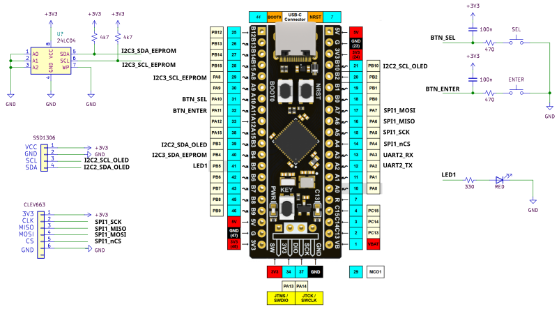

## Inicialmente vamos criar nosso projeto em uma pasta **Projeto_FreeRTOS_LOG_EEPROM_RFID_OLED_2BTC_1LED**

### crie as pastas
- application
- board
- libs
- stm32f411c6ue

Em seguida adicione o .gitignore

codigo: [.gitignore](/.gitignore)

### Crie o projeto na IDE da STM 

Ao criar o projeto na IDE da STM coloque com o nome:

```bash
stm32f411c6ue
```
Lembre-se de selecionar a pasta **stm32f411c6ue** criada dentro de **Projeto_FreeRTOS_LOG_EEPROM_RFID_OLED_2BTC_1LED**

### Criando repositorio no github 

Criando repositorio em New

Crie o repositorio

```bash
Projeto_FreeRTOS_LOG_EEPROM_RFID_OLED_2BTC_1LED
```

Na pasta do projeto em seu computador suba o projeto:

```bash
echo "# Projeto_FreeRTOS_LOG_EEPROM_RFID_OLED_2BTC_1LED" >> README.md
git init
git add README.md
git commit -m "first commit"
git branch -M main
git remote add origin git@github.com:Werllley007/Projeto_FreeRTOS_LOG_EEPROM_RFID_OLED_2BTC_1LED.git
git push -u origin main
```

Na IDE STM vá direto no GIT e adicione o projeto dentro da pasta do projeto.

### Adicionar as Bibliotecas e configurando as Pastas

Arraster as pastas para cima do projeto na IDE STM, as pastas são:
- application
- board
- libs

Vai aparecer três opções selecione:

```bash
Link files and folders
```

Deixe marcado:
```bash
Create link locations relative to: PROJECT_LOC
```

Adicione as biblioteca em **Paths and Symbols** no caminho

```bash
Properties -> C/C++ General -> Paths and Symbols

Na aba Includes 
```
No botão: (Add...) depois no botão: (workspace)

```bash
/${ProjName}/libs
/${ProjName}/board
/${ProjName}/application
```
Depois adicione as **libs**:

Na pasta **libs**  tem que adicionar as seguintes pastas dentro:
- libs/eeprom - 
caminho: [eeprom](libs/eeprom/)
- libs/MFRC630 - 
caminho: [MFRC630](libs/MFRC630/)
- libs/ssd1306 - 
caminho: [ssd1306](libs/ssd1306/)

No botão: (Add...) depois no botão: (workspace)

```bash
/${ProjName}/libs/eeprom
/${ProjName}/libs/MFRC630
/${ProjName}/libs/ssd1306
```

Adicione as biblioteca em **Paths and Symbols** no caminho

```bash
Properties -> C/C++ General -> Paths and Symbols

Na aba Includes 
```
No botão: (Add Folder...), adicione:

```bash
/stm32f411ceu6/application
/stm32f411ceu6/board
/stm32f411ceu6/libs
```

### Configurando o FreeRTOS

No botão: (Add...) depois no botão: (workspace)

- libs/FreeRTOS - 
caminho: [FreeRTOS](libs/FreeRTOS/include)
caminho: [FreeRTOS](libs/FreeRTOS/portable/GCC/ARM_CM4F/)

Configure o FreeRTOSConfig.h, adicione em:

- **stm32f411ceu6/Core/Inc/FreeRTOSConfig.h**
caminho: [FreeRTOSConfig.h](stm32f411ceu6/Core/Inc/FreeRTOSConfig.h)

**Observação, caso queira adicionar submodulos siga os passos abaixo**:

Você pode adicionar submodulos indo em GIT na IDE do STM:

Copie primeiro o link no github do modulo que vai usar no caso é o FreeRTOS (Digite no google FreeRTOS Kernel e encontre o projeto depois copie). Em seguida:

```bash
Na IDE STM -> clique com o direto do mouse no projeto do GIT **Projeto_FreeRTOS_LOG_EEPROM_RFID_OLED_2BTC_1LED** 

Selecione -> ADD SUBMODULE

digite: lib/FreeRTOS

cole o link do github: https://github.com/FreeRTOS/FreeRTOS-Kernel.git

Finish
```
# Desenvolvendo projeto

Inicialmente, clique em Build.

- Por enquanto, vai gerar erros **#include "ssd1306_conf.h"**, para ir desenvolvendo aos poucos retire os seguintes caminhos:

```bash
/${ProjName}/libs/ssd1306

/stm32f411ceu6/libs
```

Vamos criar os arquivos em **board**, pressione Ctrl+N:

```bash
Header File

-> board.h

Source File

-> board.c
```

Vamos criar os arquivos em **application**, pressione Ctrl+N:

```bash
Header File

-> app.h
-> interface.h
-> register.h
-> storage.h
-> utils.h

Source File

-> app.c
-> interface.c
-> register.c
-> storage.c
-> callbacks.c
```


